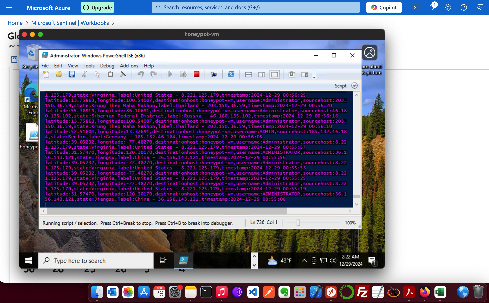
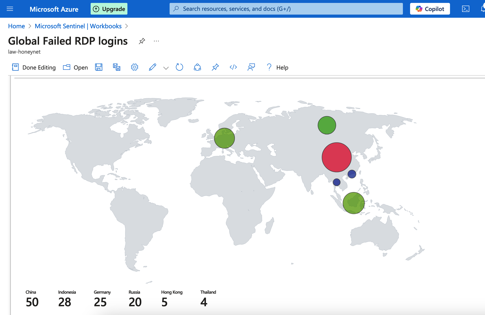

## 📌 Overview
This project demonstrates the creation of a cloud-based honeypot using **Azure Sentinel** and **Log Analytics Workspace** to detect and visualize brute-force RDP login attempts in real-time.

In just **24 hours**, the honeypot recorded hundreds of login attempts from multiple countries worldwide — all visualized on a custom Sentinel dashboard.

---

## 🎯 Objectives
- Gain hands-on experience with Azure Sentinel & Log Analytics.
- Collect and analyze Event ID 4625 (failed RDP login attempts).
- Visualize attacker IP geolocation on an interactive map.

---

## 🛠 Architecture

---

## ⚙️ Setup Process

### 1. Deploy Azure VM Honeypot
- Created Windows 10 VM on Azure with RDP open to the internet.

### 2. Configure PowerShell Script
- Used [Custom Security Log Exporter](https://github.com/joshmadakor1/Sentinel-Lab/blob/main/Custom_Security_Log_Exporter.ps1).
- Extracted:
  - Username attempted
  - Attacker IP
  - Geolocation (via ipgeolocation.io API)
    
- Saved data to `.log` file.

### 3. Forward Logs to Azure
- Connected VM logs to **Azure Log Analytics Workspace**.

### 4. Integrate with Sentinel
- Connected Log Analytics to **Microsoft Sentinel**.
- Created **custom workbook** to display attacks on a global map.

---

## 📊 Results
- **Hundreds** of login attempts within 24 hours.
- Attacks originated from **multiple continents**.
- Gained insights into brute-force attack patterns.

